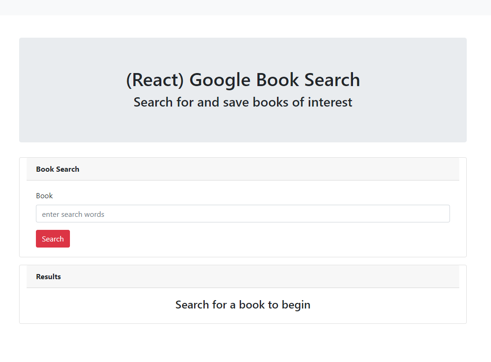
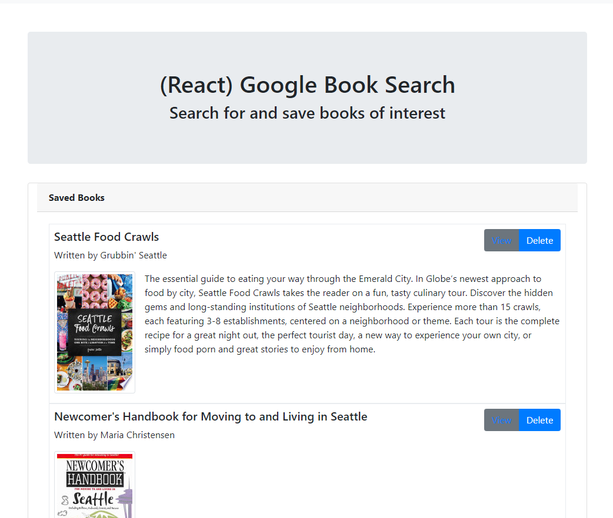

# Google Books Search

### Overview

I have created a new React-based Google Books Search app which uses React components, helper / util functions, and utilizes React lifecycle methods to query and display books based on user searches. Also, this app uses Node, Express, MongoDB and Mongoose so that users can save books to review or purchase later. This is a single page app (SPA) that uses [`react-router-dom`](https://github.com/reactjs/react-router) to navigate, hide and show your React components without changing the route within Express.

### Details

- This application has 2 pages - search and saved books.

  - [Search](Search.png) - User can search for books via the Google Books API and render them here. User has the option to "View" a book, bringing them to the book on Google Books, or "Save" a book, saving it to the Mongo database.

  - [Saved](Saved.png) - Renders all books saved to the Mongo database. User has an option to "View" the book, bringing them to the book on Google Books, or "Delete" a book, removing it from the Mongo database which stores the following:

    - `title` - Title of the book from the Google Books API
    - `authors` - The books's author(s) as returned from the Google Books API
    - `description` - The book's description as returned from the Google Books API
    - `image` - The Book's thumbnail image as returned from the Google Books API
    - `link` - The Book's information link as returned from the Google Books API

### Search Form
---

### Search Result
---

### Saved Book List
---

